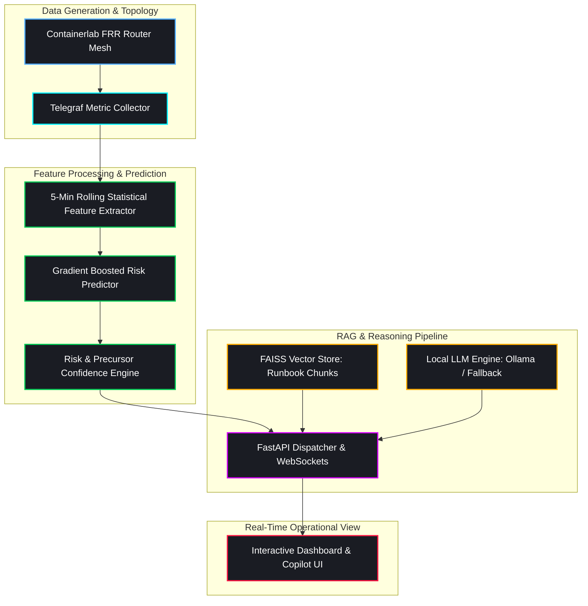
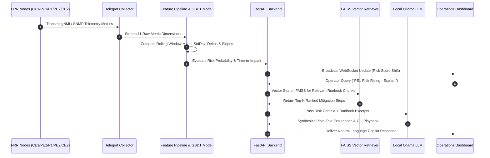
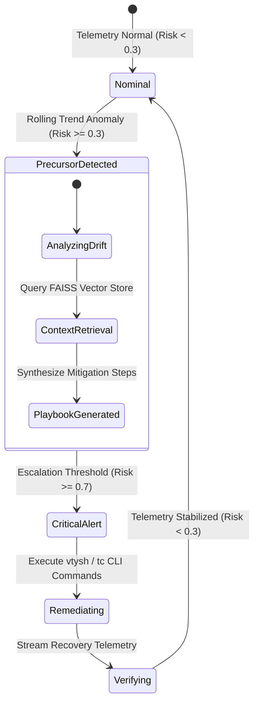

<div align="center">


<p align="center">
  <b>Production-Grade Network Operations Center Intelligence Engine</b>
</p>

[](LICENSE)
[](https://www.python.org/)
[](https://fastapi.tiangolo.com/)
[](https://github.com/facebookresearch/faiss)
[](#security--isolation-assertions)

</div>

---

## Technical Architecture

The Air-Gapped Predictive NOC Copilot is an autonomous time-series intelligence platform built for zero-trust, zero-cloud network environments. It analyzes multi-node routing and interface telemetry in real time to forecast infrastructure failure precursors 60 to 90 seconds before user SLA breach, executing local RAG synthesis to deliver actionable, vendor-specific CLI remediation playbooks.



---

## Data & Event Sequence Flow

The following sequence illustrates how telemetry frames are processed from raw interface counters down to RAG-augmented natural language explanations:



---

## System State Machine



---

## System Capabilities

<table>
  <tr>
    <th width="30%">Module</th>
    <th width="70%">Description & Performance Specification</th>
  </tr>
  <tr>
    <td><b>Precursor Detection Engine</b></td>
    <td>Predicts 4 major failure classes: <code>congestion</code>, <code>bgp_instability</code>, <code>mpls_degradation</code>, and <code>policy_drift</code> prior to threshold breaching. Evaluates 11 primary telemetry dimensions with rolling statistical windows.</td>
  </tr>
  <tr>
    <td><b>FAISS RAG Subsystem</b></td>
    <td>Vector index built over internal router runbooks using <code>BAAI/bge-small-en-v1.5</code> embeddings. Retrieves context-aware remediation steps with exact <code>vtysh</code> and <code>tc</code> commands.</td>
  </tr>
  <tr>
    <td><b>Air-Gapped Isolation</b></td>
    <td>Strict zero-cloud operation. Network guards explicitly block non-local outbound connections. Local execution via Ollama and Python fallback layers.</td>
  </tr>
  <tr>
    <td><b>Multi-Node FRR Sim</b></td>
    <td>Containerlab configuration supporting 5 FRR nodes (<code>CE1</code>, <code>PE1</code>, <code>P1</code>, <code>PE2</code>, <code>CE2</code>) executing OSPF Area 0, MPLS LDP, iBGP VPNv4, and IPsec tunnel overlays.</td>
  </tr>
  <tr>
    <td><b>Impairment Driver</b></td>
    <td>Ramping fault injection framework supporting linear metric degradation and complete dry-run command emulation.</td>
  </tr>
</table>

---

## Installation & Deployment

### Local Environment Setup

1. Clone repository:
   ```bash
   git clone https://github.com/Tayab-Ahamed/Airgap-noc-Copilot.git
   cd Airgap-noc-Copilot
   ```

2. Create virtual environment and install dependencies:
   ```bash
   python3 -m venv .venv
   source .venv/bin/activate
   pip install -r requirements.txt
   ```

3. Generate synthetic telemetry:
   ```bash
   python -m ml.synthetic_data --minutes 240 --out data/telemetry.parquet
   ```

4. Train ML predictor model:
   ```bash
   python -m ml.train --data data/telemetry.parquet --out models/ --eval-seed 42
   ```

5. Build RAG vector index:
   ```bash
   python -m rag.indexer --docs rag/runbooks --out data/faiss_index
   ```

6. Start API server:
   ```bash
   uvicorn backend.main:app --port 8000
   ```

7. Open `frontend/index.html` in your browser to view the real-time operations dashboard.

---

## Containerlab Network Emulation

1. Load required Linux kernel modules for MPLS data plane forwarding:
   ```bash
   sudo modprobe mpls_router
   sudo modprobe mpls_iptunnel
   ```

2. Deploy containerlab topology:
   ```bash
   cd sim/
   sudo containerlab deploy -t topology.clab.yml
   ```

3. Inspect router control plane adjacencies:
   ```bash
   sudo docker exec -it clab-airgap-noc-pe1 vtysh -c "show ip ospf neighbor"
   sudo docker exec -it clab-airgap-noc-pe1 vtysh -c "show bgp summary"
   ```

4. Trigger test fault scenarios (Dry-Run Mode):
   ```bash
   DRY_RUN=1 python -m sim.fault_injector --scenario congestion --target PE1
   DRY_RUN=1 python -m sim.fault_injector --scenario clear
   ```

5. Destroy containerlab topology:
   ```bash
   sudo containerlab destroy -t sim/topology.clab.yml --cleanup
   ```

---

## Project Structure

| Path | Purpose |
|---|---|
| `backend/` | FastAPI REST endpoints, WebSocket streaming, and risk scorer integration |
| `core/` | Application configuration, security boundary assertions, and SQLite storage |
| `ml/` | Telemetry pipelines, feature engineering, GBDT predictor, and synthetic generator |
| `rag/` | Vector index builder, FAISS retriever, and Markdown NOC runbooks |
| `llm/` | Ollama client interface and offline fallback execution logic |
| `sim/` | Containerlab topology definition, FRR node configuration files, and fault injector |
| `telemetry/` | Telegraf configuration files for metric collection |
| `frontend/` | Standalone operational dashboard interface |
| `docs/` | Operations guide and operational manual |
| `scripts/` | Dependency predownloading and network air-gap validation scripts |

---

## Security & Isolation Assertions

- Zero runtime outbound HTTP/HTTPS calls.
- Programmatic air-gap verification via `settings.assert_airgap_safe()`.
- System validation via `bash scripts/verify_airgap.sh`.

---

## License

This software is released under the **MIT License**. See [LICENSE](LICENSE) for full details.
