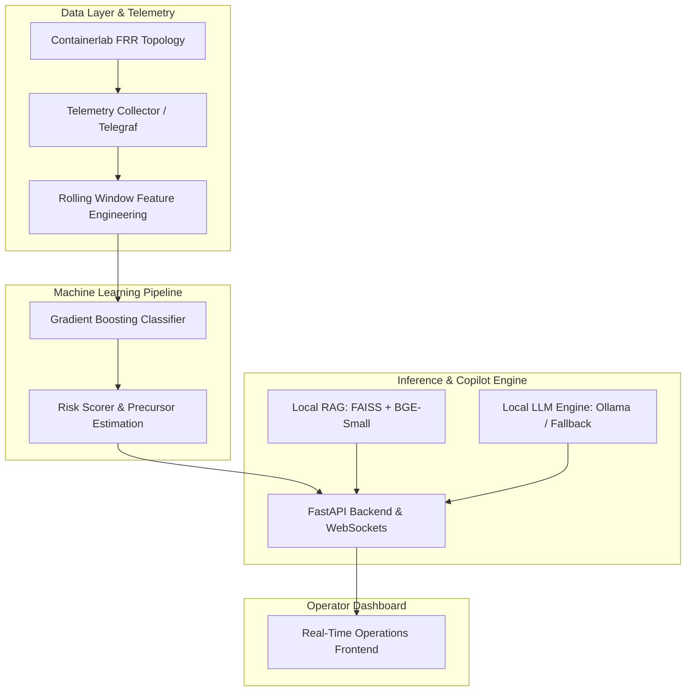

# Air-Gapped Predictive NOC Copilot (ISRO PS13)

[](LICENSE)
[](https://www.python.org/downloads/)
[](https://fastapi.tiangolo.com/)
[](https://github.com/facebookresearch/faiss)
[](#security--air-gap-compliance)

An autonomous, production-grade, air-gapped AI Network Operations Center (NOC) Copilot engineered for zero-cloud environments. The system combines real-time time-series precursor telemetry modeling with local Retrieval-Augmented Generation (RAG) over internal router runbooks to detect and mitigate network anomalies prior to SLA impact.

---

## Architecture



### Data & Execution Flow Diagram

```
Containerlab FRR Sim ──► Telemetry Collector ──► Feature Engineering ──► ML Risk Engine
                                                                              │
                                                                              ▼
              Local LLM + FAISS RAG (Runbooks DB) ───────────────► FastAPI Backend ──► Real-Time Dashboard
```

The core architectural principle dictates strict separation of duties: the **Machine Learning Engine calculates failure probability and time-to-impact**, while the **Local LLM Engine generates narrative explanations and actionable CLI runbook steps**. The LLM operates purely on retrieved contextual evidence and does not forecast failure metrics independently.

---

## Technical Overview

* **Precursor Fault Forecasting**: Identifies early degradation patterns across 4 network failure modes (`congestion`, `bgp_instability`, `mpls_degradation`, `policy_drift`) 60 to 90 seconds prior to user-visible service loss.
* **Air-Gapped RAG Engine**: Utilizes vector search (`FAISS` with `BAAI/bge-small-en-v1.5` embeddings) across internal network runbooks to construct targeted mitigation steps containing exact `vtysh` and `tc` commands.
* **Deterministic Risk Scoring**: Evaluates rolling window statistical metrics (mean, standard deviation, deltas, and 5-minute slopes) on 11 raw interface and routing telemetry attributes.
* **Emulated Multi-Node Topology**: Built for containerlab deployments using `frrouting/frr:v8.4.0` nodes executing OSPF Area 0, MPLS LDP, iBGP VPNv4, and IPsec tunnel stubs across customer edge (CE), provider edge (PE), and core (P) routers.
* **Fault Injection Framework**: Includes ramping live traffic impairment drivers for network testing and continuous validation with full dry-run capability.

---

## Getting Started

### Prerequisites

* Python 3.10 or higher
* `pip` package manager
* Linux/macOS or Windows PowerShell environment

### Local Setup

1. Clone the repository and navigate to the project root:
   ```bash
   git clone https://github.com/Tayab-Ahamed/Airgap-noc-Copilot.git
   cd Airgap-noc-Copilot
   ```

2. Create and activate a Python virtual environment:
   ```bash
   python3 -m venv .venv
   source .venv/bin/activate
   ```

3. Install required dependencies:
   ```bash
   pip install -r requirements.txt
   ```

4. Generate synthetic telemetry dataset:
   ```bash
   python -m ml.synthetic_data --minutes 240 --out data/telemetry.parquet
   ```

5. Train the risk prediction model:
   ```bash
   python -m ml.train --data data/telemetry.parquet --out models/ --eval-seed 42
   ```

6. Build the vector database index from runbooks:
   ```bash
   python -m rag.indexer --docs rag/runbooks --out data/faiss_index
   ```

7. Start the API service:
   ```bash
   uvicorn backend.main:app --port 8000
   ```

8. Access the dashboard by opening `frontend/index.html` in your browser.

---

## Containerlab Emulation Deployment

To run against a live network simulation environment:

1. Load the required kernel modules on the Linux host:
   ```bash
   sudo modprobe mpls_router
   sudo modprobe mpls_iptunnel
   ```

2. Deploy the network topology:
   ```bash
   cd sim/
   sudo containerlab deploy -t topology.clab.yml
   ```

3. Verify control plane adjacencies:
   ```bash
   sudo docker exec -it clab-airgap-noc-pe1 vtysh -c "show ip ospf neighbor"
   sudo docker exec -it clab-airgap-noc-pe1 vtysh -c "show bgp summary"
   ```

4. Run fault injection scenarios:
   ```bash
   DRY_RUN=1 python -m sim.fault_injector --scenario congestion --target PE1
   DRY_RUN=1 python -m sim.fault_injector --scenario clear
   ```

5. Teardown topology:
   ```bash
   sudo containerlab destroy -t sim/topology.clab.yml --cleanup
   ```

---

## Directory Structure

| Directory | Purpose |
|---|---|
| `backend/` | FastAPI application, REST endpoints, WebSocket streaming, and risk evaluation |
| `core/` | Configuration management, security assertions, and SQLite storage |
| `ml/` | Telemetry processing, feature engineering, baseline & XGBoost/GBDT classifiers |
| `rag/` | FAISS index generation, vector retriever, and markdown NOC runbooks |
| `llm/` | Local Ollama integration interface and offline fallback handlers |
| `sim/` | Containerlab topology definition, FRR node configuration files, and fault injector |
| `telemetry/` | Telegraf configuration files for SNMP/gNMI data ingestion |
| `frontend/` | Standalone real-time NOC operations dashboard interface |
| `docs/` | Operations manual and deployment documentation |
| `scripts/` | Dependency predownloading and network air-gap validation scripts |

---

## Security & Air-Gap Compliance

- Zero external HTTP/HTTPS egress at runtime.
- Backend validates network connectivity isolation via `settings.assert_airgap_safe()`.
- Runbook context retrieval uses local filesystem vector storage (`data/faiss_index`).
- Verification script available via `bash scripts/verify_airgap.sh`.

---

## License

This project is licensed under the MIT License. See [LICENSE](LICENSE) for details.
